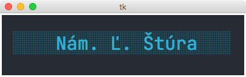

# Bus stops

A simple app showing bus stops from file written in [Python](https://www.python.org) using the built-in [`tkinter`](https://docs.python.org/3/library/tkinter.html) library.

<p align="center">
  
</p>

## Requirements

- [Python 3](https://www.python.org) with [`tkinter`](https://docs.python.org/3/library/tkinter.html)
- _(Optional)_ [JetBrains Mono](https://fonts.google.com/specimen/JetBrains+Mono) font

## Usage

To start the app, download or clone this repository, and in the folder you downloaded or cloned, run:

```
$ python bus_stops.py
```

You can move to the next bus stop by pressing any key on the keyboard.
